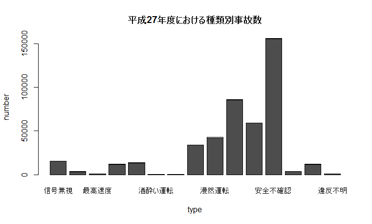
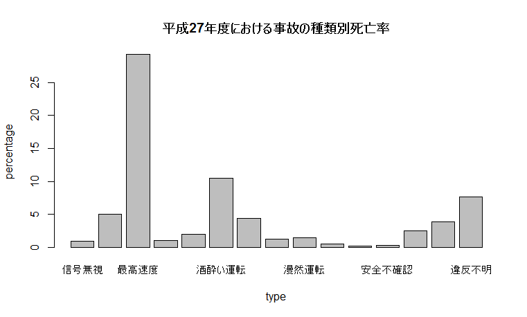
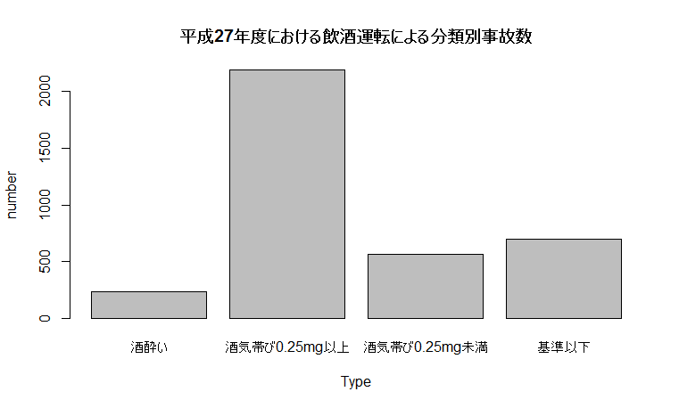
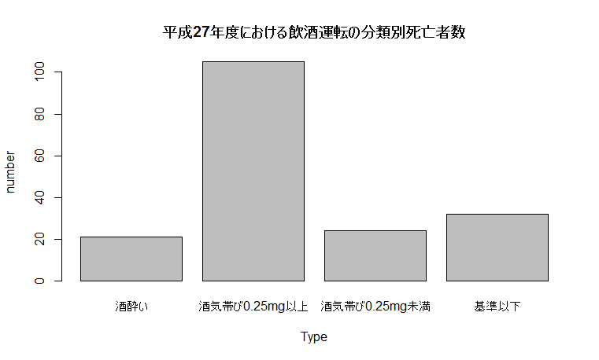
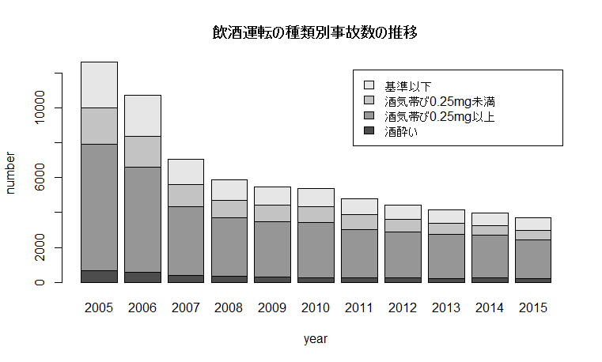

# データビジュアライゼーション

## 平成27年度における種類別交通事故数
  
単純な発生数を見てみると安全不確認、脇見運転など、安全運転義務違反による事故が圧倒的に多いことがわかる。  
  
しかし、総発生数に対する死亡事故の割合は以上のように最高速度違反、飲酒運転、過労運転が特に多い。  

## 飲酒運転に関する分析
今回は、死亡事故の可能性が高いもののうち、飲酒運転について取り上げる。  
飲酒運転には、酒酔い運転と酒気帯び運転の二種類があり、  
酒酔い運転はアルコール濃度の検知値にかかわらず「アルコールの影響により正常な運転ができない恐れがある状態」を指し、  
酒気帯び運転は血中アルコール濃度が一定量に達しているかどうかで判断される。  
平成27年度における飲酒運転の種類を細分化したグラフは以下のようになる。  
  
  
どちらも酒気帯び運転0.25mg以上での事故の数が多い。  
両者を見比べることによって、飲酒運転の種類によって死亡率に変化は認められないことがわかる。  
  
以上のグラフから飲酒事故の総数は減少傾向にはあるが、緩やかなものであることがわかる。  
また、2007年には飲酒運転の罰則が厳罰化されており、その年の事故数は前年度と比べて大きく減少している。  
したがって、法律などによる規則の強化は、事故の防止に効果的であるといえる。  

参考資料 
- [e-stat 平成27年中の交通死亡事故の発生状況及び道路交通法違反取締り状況について]<http://www.e-stat.go.jp/SG1/estat/List.do?lid=000001150519>
- [e-stat 平成27年における交通事故の発生状況]<http://www.e-stat.go.jp/SG1/estat/List.do?lid=000001150496>
